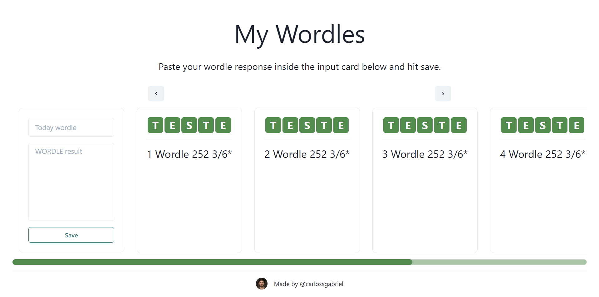

# My Wordles
---

As most people know by now, the game [Wordle](https://www.nytimes.com/games/wordle/index.html) has exploded in popularity since its launch in 2021. The game is a word puzzle that is played by placing letters on a grid, trying clueless, to get the right word of the day.

Inspired by the game, I created a web app that allows you to save your wordle for the day and keep track of your progress.

It's currently under development, but you can see a screenshot of the app on it's current state.



## Getting Started

First, run the development server:

```bash
npm run dev
# or
yarn dev
```

Open [http://localhost:3000](http://localhost:3000) with your browser to see the result.


